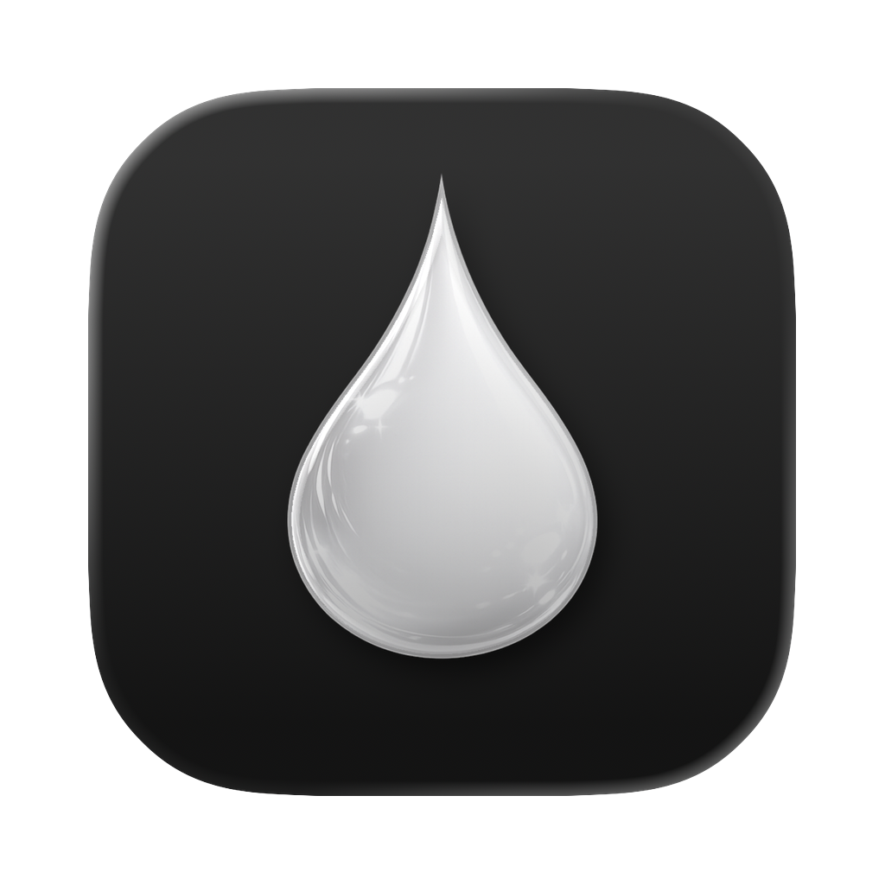

# Vapor

A modern, frosted-glass terminal emulator for macOS built with Electron, React, and xterm.js.



## Features

- **Beautiful macOS-native vibrancy** - Frosted glass effect with customizable vibrancy modes
- **Advanced pane management** - Split terminals horizontally/vertically with drag-to-resize
- **Multiple tabs** - Full tab support with custom naming and keyboard navigation
- **Integrated file editor** - Monaco editor with syntax highlighting
- **Smart context detection** - Automatically detects SSH sessions, Docker containers, and remote environments
- **Layout persistence** - Save and restore complex multi-tab, multi-pane layouts
- **Shell integration** - OSC sequence support for command status, exit codes, and working directory tracking
- **Highly configurable** - Customizable fonts, colors, shell, and vibrancy settings

## Quick Start

### Installation

```bash
# Install dependencies
npm install

# Run in development mode
npm start

# Build for production
npm run package

# Create distributable DMG
npm run make
```

### First Launch

On first launch, Vapor will create a default configuration in the Electron user data directory (`~/Library/Application Support/Vapor/config.json` on macOS). You can also access settings via `Cmd+,`.

## Documentation

- [Architecture](docs/architecture.md) - System design and code organization
- [Development Guide](docs/development.md) - How to build, test, and contribute
- [Configuration](docs/configuration.md) - Customization options
- [Features](docs/features.md) - Detailed feature guide
- [Testing](docs/testing.md) - Testing strategy and running tests

## Key Bindings

| Key | Action |
|-----|--------|
| `Cmd+T` | New tab |
| `Cmd+N` | New window |
| `Cmd+W` | Close tab/pane |
| `Cmd+D` | Split pane horizontally |
| `Cmd+Shift+D` | Split pane vertically |
| `Cmd+1-9` | Jump to tab |
| `Cmd+B` | Toggle sidebar |
| `Cmd+Shift+O` | Open folder |
| `Cmd+K` | Clear terminal |
| `Cmd+F` | Find in terminal |
| `Cmd+,` | Settings |
| `Option+Shift+Arrow` | Navigate between panes |

## Technology Stack

- **Electron 41** - Cross-platform desktop framework
- **React 19** - UI framework with hooks
- **TypeScript 4.5** - Type-safe development
- **xterm.js 5** - Terminal emulation (with WebGL renderer)
- **Monaco Editor** - Code editor (VSCode's editor)
- **Zustand 5** - Lightweight state management
- **react-mosaic** - Split pane layout management
- **node-pty** - Native pseudoterminal bindings
- **ssh2** - SSH connection support
- **Vitest** - Fast unit testing

## Project Structure

```
vapor/
├── src/
│   ├── main/                    # Electron main process
│   │   ├── config.ts            # Configuration management
│   │   ├── pty-manager.ts       # PTY session handling
│   │   ├── tab-namer.ts         # Smart tab naming
│   │   ├── layout-manager.ts    # Layout save/restore
│   │   ├── fs-handler.ts        # Local file system operations
│   │   ├── remote-fs-handler.ts # Remote file system (SFTP/shell)
│   │   ├── ssh-handler.ts       # SSH connection management
│   │   ├── ssh-connection-pool.ts # SFTP connection pooling
│   │   ├── ssh-shell-executor.ts  # Remote shell commands
│   │   ├── host-manager.ts      # SSH config & Docker host discovery
│   │   ├── remote-context.ts    # Remote FS abstraction
│   │   ├── menu.ts              # Application menu
│   │   ├── cli-server.ts        # CLI tool socket server
│   │   └── settings-window.ts   # Settings window
│   ├── renderer/                # React UI
│   │   ├── App.tsx              # Main app component
│   │   ├── components/          # React components
│   │   ├── store/               # Zustand stores
│   │   ├── hooks/               # Custom React hooks
│   │   └── utils/               # Utility functions
│   ├── shared/                  # Shared types and constants
│   ├── preload.ts               # IPC bridge (contextBridge)
│   └── index.ts                 # Electron entry point
├── assets/                      # Icons and images
├── bin/                         # CLI tool (vpr)
├── docs/                        # Documentation
└── marketing/                   # Website and screenshots
```

## Configuration

Vapor stores its configuration in the Electron user data directory:

- **macOS:** `~/Library/Application Support/Vapor/config.json`

```json
{
  "font": {
    "family": "SFMono Nerd Font, SF Mono, Monaco, monospace",
    "size": 12,
    "ligatures": true
  },
  "shell": {
    "path": "",
    "args": []
  },
  "theme": {
    "background": "rgba(0, 0, 0, 0.65)",
    "foreground": "#FFFFFF",
    "cursor": "#0095FF",
    ...
  },
  "vibrancy": "under-window",
  "background": {
    "transparent": true,
    "opaqueColor": "#121212"
  },
  "window": {
    "width": 800,
    "height": 600
  }
}
```

See [Configuration Guide](docs/configuration.md) for all options.

## Development

### Prerequisites

- Node.js 18+
- macOS (for vibrancy features)
- Xcode Command Line Tools (for native module compilation)
- Python 3 (for node-gyp)

### Building

```bash
# Install dependencies
npm install

# Rebuild native modules for Electron
npm run postinstall

# Start development server with hot reload
npm start

# Run tests
npm test

# Run tests in watch mode
npm run test:watch

# Lint code
npm run lint

# Build production packages
npm run package

# Create DMG installer
npm run make -- --arch=arm64
```

### Testing

Vapor has comprehensive unit tests for core functionality:

```bash
# Run all tests
npm test

# Watch mode for TDD
npm run test:watch

# Run specific test file
npm test -- src/main/pty-manager.test.ts
```

## Architecture Highlights

### IPC Communication

Vapor uses Electron's contextBridge for secure IPC:
- Main process handlers in `src/main/*`
- Preload script exposes typed API at `window.vapor`
- Renderer uses React hooks to consume the API

### State Management

Zustand stores manage application state:
- `useTabPaneStore` - Tab and pane tree structure, SSH/Docker context
- `useEditorStore` - Multi-file Monaco editor state (open files, dirty tracking)
- `useSidebarStore` - File tree state with remote host support
- `useNavigationStore` - Keyboard navigation between panes/tabs
- `useConfigStore` - Application configuration

### PTY Management

The PTY manager handles terminal sessions with:
- Process tracking and CWD detection
- OSC sequence parsing for shell integration (OSC 7, OSC 133, OSC 633)
- SSH and Docker container detection
- Remote environment support
- Session state tracking

### Split Pane System

Panes are organized in a binary tree:
- Leaf nodes: terminals or editors
- Split nodes: horizontal/vertical containers with resize ratio (10%-90%)
- react-mosaic-component handles drag-to-resize

## Contributing

Contributions are welcome! Please:

1. Fork the repository
2. Create a feature branch
3. Add tests for new functionality
4. Ensure all tests pass
5. Submit a pull request

## License

MIT License

## Author

Peter Sauer (peter.sauer@applied.co)
